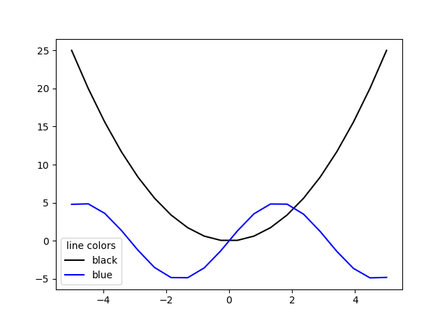

# HELLO WORLD PYTHON : LEARN BY DOING
> Attached: MIT License
>Copyright (c) 2018 Andrew Garcia

## HOW TO GET STARTED

* **Install Git** and open a **Github account**
	If you haven't already, install Git. This is separate to Github. Check out this link for a great video for helping you set it up on your computer and learn some useful functions of it: https://www.youtube.com/watch?v=SWYqp7iY_Tc

* Clone this **hello-world-python repository**
	If you scroll up all the way you'll see a green "Code" button. Click on it and copy the whole https:// address.
	Open your Terminal/command line or Git Bash in a folder where you want to clone this whole repository. Then type "git clone" followed by the https you copied ( **git clone https://...** )

This will copy all the files to your computer. Check out each of the .py files and learn by running them and associating the outputs to the written code.  

## SOME CONTENTS

## hello.py
Learn how to print strings.

# Plotting scripts (in order of increasing complexity)
## plot.py

## plot2.py

## plot3.py

## plot4.py

## function.py
Learn how to make and print functions
